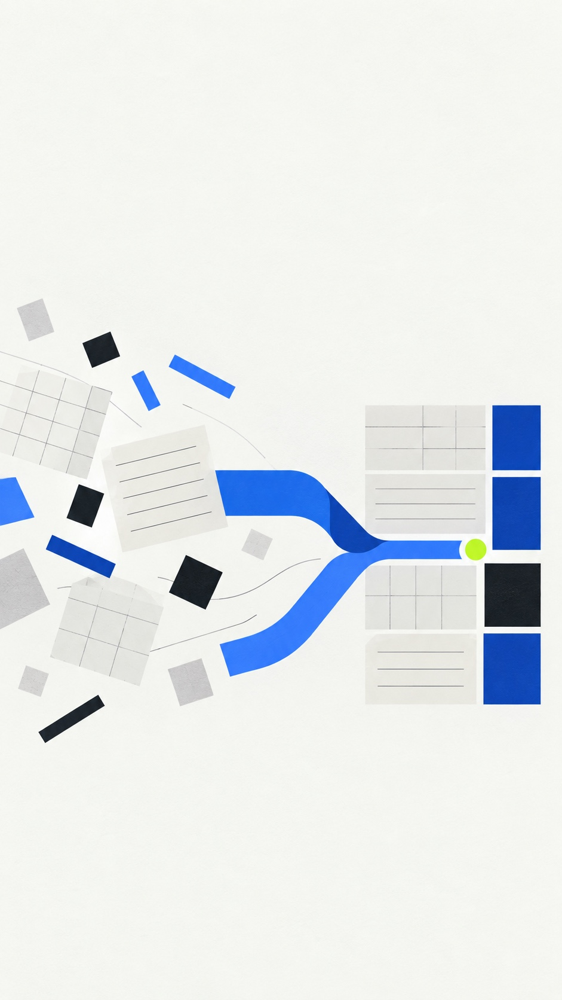
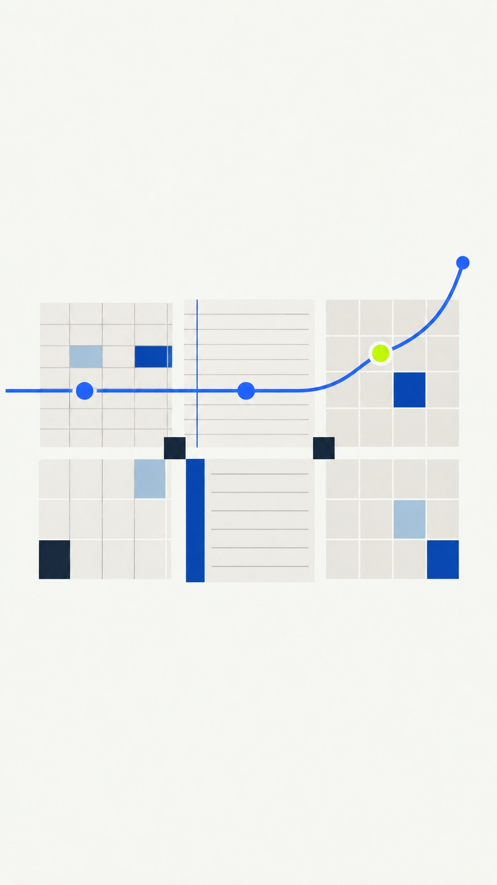
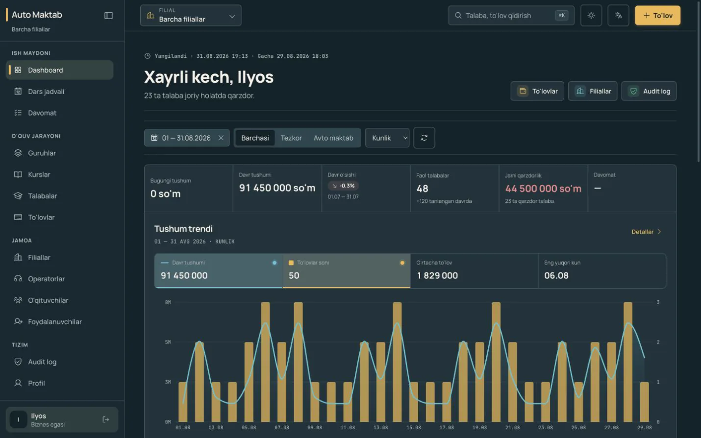
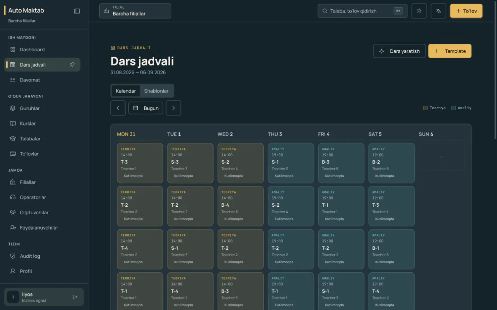
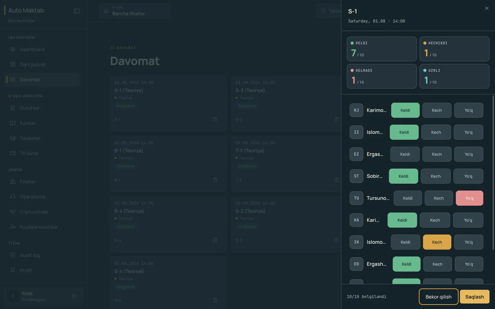

# Automaktab product video — storyboard v1

Checkpoint 1 includes the locked narration layout, two generated atmosphere stills, three unmodified synthetic-demo product screens, and the approved flat logo. It does not authorize publication.

Production approach: [Automaktab product video production approach](../../plans/2026-09-17-automaktab-product-video.md).

## Frame 01 — the control question

**Time:** `00:00–00:03`

- **On-screen copy:** `Rahbar yo‘q paytda nazorat qayerda qoladi?`
- **Narration:** “Rahbar yo‘q paytda nazorat qayerda qoladi?”
- **Motion:** spreadsheet, notebook, and calendar fragments drift independently for 12–16 frames; the blue path then begins pulling them toward one axis.
- **Sound:** one restrained low pulse, light paper/keyboard texture, no dramatic hit.
- **Brand rule:** abstract fragments only; no generated words, fake data, customer information, or vehicle clichés.

## Frame 02 — fragments become a control center

**Time:** `00:03–00:06`

- **On-screen copy:** `Hammasi bir joyda.`
- **Narration:** “Excel, daftar va xotiradagi bo‘laklarni bir joyda ko‘ring.”
- **Motion:** fragments snap into a calm modular grid. The real Folded Ascent icon draws as a flat path above the grid; its single Signal Lime point pulses once. Do not generate or redraw the mark.
- **Transition:** the rising blue line becomes the reveal mask for the real dashboard.
- **Logo source:** [approved icon master](../logo-final/master/icon.svg).

## Frame 03 — revenue and debt proof

**Time:** `00:06–00:12`

- **On-screen copy:** `Tushum va qarzdorlik`
- **Narration:** “Automaktab.uz tushum va qarzdorlikni…”
- **Motion:** use the real synthetic-demo recording when available. For the screenshot fallback, apply a slow crop-only push from the revenue metric to the debt metric, then settle on the trend view.
- **Evidence rule:** preserve every displayed value and UI state; no repainting, relabeling, or fabricated activity.

## Frame 04 — schedule proof

**Time:** `00:12–00:17`

- **On-screen copy:** `Dars jadvali`
- **Narration:** “…dars jadvalini…”
- **Motion:** one horizontal crop-only move across the week, with a subtle focus hold on the real lesson cards. A real pointer interaction may replace this only when captured from the synthetic demo.
- **Transition:** the calendar grid aligns with the attendance status grid; no device mockup.

## Frame 05 — attendance proof

**Time:** `00:17–00:22`

- **On-screen copy:** `Davomat`
- **Narration:** “…va davomatni bitta boshqaruv maydonida ko‘rsatadi.”
- **Motion:** hold the real attendance drawer legibly; one approved real click or crop-only emphasis lands on a status control. Do not animate a status change that did not occur in the captured demo.
- **Sound:** one quiet interface confirmation aligned to the real interaction.

## Frame 06 — proof resolves into one system

**Time:** `00:22–00:26`

- **Picture:** the three verified product views above resolve into three clean, stacked crop windows on Field Paper. No new UI is drawn; each window is a crop of its source image.
- **On-screen copy:** `Demo — tizimning o‘zi.`
- **Narration:** “Demo — prezentatsiya emas. Tizimning o‘zi.”
- **Motion:** dashboard, schedule, and attendance panels settle on a shared baseline; the same Data Blue path connects them without covering evidence.
- **Sound:** the electronic pulse resolves; leave room before the end-card line.

## Frame 07 — one clear action

**Time:** `00:26–00:30`

- **Display line:** `Avtomaktabingiz. Doim nazoratda.`
- **CTA:** `Demo’ni hozir oching — automaktab.uz`
- **Support line:** `30 kun bepul`
- **Narration:** “Avtomaktabingiz doim nazoratda. Demo’ni hozir oching. 30 kun bepul.”
- **Motion:** the real flat mark completes its fold; the single lime point pulses once. Wordmark, CTA, and trial line appear without bounce or 3D treatment.
- **Sound:** one clean signal at the lime pulse, then a short clean tail.

## Locked narration layout

| Time | Narration | Subtitle treatment |
| --- | --- | --- |
| `00:00–00:03` | Rahbar yo‘q paytda nazorat qayerda qoladi? | Two lines maximum; hook centered in the upper safe zone. |
| `00:03–00:06` | Excel, daftar va xotiradagi bo‘laklarni bir joyda ko‘ring. | Bottom safe zone; emphasize `bir joyda` with weight, not color noise. |
| `00:06–00:12` | Automaktab.uz tushum va qarzdorlikni… | Bottom safe zone over a solid Control Ink caption plate if contrast requires it. |
| `00:12–00:17` | …dars jadvalini… | One short line. |
| `00:17–00:22` | …va davomatni bitta boshqaruv maydonida ko‘rsatadi. | Two lines maximum; do not cover real attendance controls. |
| `00:22–00:26` | Demo — prezentatsiya emas. Tizimning o‘zi. | One sentence per beat. |
| `00:26–00:30` | Avtomaktabingiz doim nazoratda. Demo’ni hozir oching. 30 kun bepul. | End card uses display line, CTA, and support line as separate hierarchy levels. |

## Composition and accessibility

- Master canvas: `1080x1920`, `30 fps`, `30 seconds`.
- Keep essential copy and the logo inside a centered `864x1536` action-safe area; reserve the bottom `320 px` for platform UI and subtitles.
- Use Unbounded only for the short display line and approved wordmark. Use Manrope for CTA and subtitles.
- Palette is restricted to Control Ink `#0B1720`, Field Paper `#F5F7F2`, Data Blue `#2F6BFF`, Deep Data Blue `#174BC5`, and Signal Lime `#C6FF3D`.
- Burned subtitles must remain readable without sound. Also export a clean master without subtitles.
- Avoid rapid flashes, large parallax, excessive easing, fake cursor movement, and motion that obscures real evidence.
- The product images are synthetic-demo evidence, not production customer data, and remain visually unmodified apart from crop, scale, and placement.

## Checkpoint boundary

The narration text and visual sequence are locked for review, but no voice audio or motion render is claimed here. The active environment does not expose a callable Higgsfield voice or video-render surface. After this checkpoint is approved and that surface is available, the next deliverable is a `6–8 second` opening motion test. Do not substitute another production renderer or publish externally without explicit approval.
